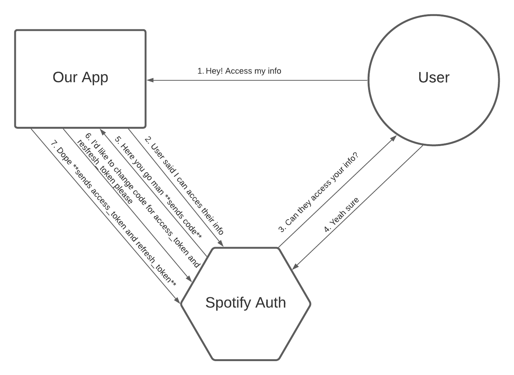

# Spotify Web App - Team 1
Text

## Inspiration 🐢
Text

## What it does 🖥
Text

## How we built it 🛠
To collaborate, we used:
 - Git

To design the website, we used:
 - Figma

To build the website, we used:
 - Text

## Challenges we ran into 😡
Text

## Accomplishments that we're proud of 🌟
Text

## What we learned ✏️
Text

## What's next
Text


## Installation
Text

## Spotify Authorization 🗝

The Spotify Authentication Service works like this (obtained from the [official documentation](https://developer.spotify.com/documentation/general/guides/authorization-guide/)):

<div align="center">
    
</div>

### Get Spotify API credentials 🎻
 - Go to the [Spotify API console](https://developer.spotify.com/dashboard/login) and login with a Spotify account.
 - Create a new application. You'll see you Client_id and Client_secret credentials, will need them later.
 - Go to the app settings and add you Redirect URIs' and save it.

### Create .env 🤫
 - Create a .env file in the frontend directory and add the following with your corresponding credentials:
 ```sh
REACT_APP_CLIENT_ID=<your-client-id>
REACT_APP_CLIENT_SECRET=<your-cliend-secret>
REACT_APP_REDIRECT_URL=<your-redirect-uri>
```

The Redirect Uri needs to match any of the ones in your Spotify API dashboard app.

### How we do the authorization ✅

When the user logs in in our app, they will be sent to the auccounts authorization url of spotify so they can grant access to our app to see their info. We ask for them the following scopes:

 - "user-top-read"
 - "user-read-email"
 - "user-read-private"
 - "user-library-read"
 - "user-library-modify"
 - "user-read-currently-playing"
 - "user-read-playback-state"
 - "playlist-read-private"
 - "playlist-modify-public"
 - "playlist-modify-private"
 - "user-modify-playback-state"

#### Observation ⚠️

Since we are using the development mode of the Spotify API you'll need to add the users' email you want to authorize to your app on the dashboard of Spotify API.

### How the Spotify Authorization url would look like 🔗

```
`https://accounts.spotify.com/authorize?client_id=${CLIENT_ID}&client_secret=${CLIENT_SECRET}&redirect_uri=${REDIRECT_URL_AFTER_LOGIN}&scope=${SCOPES_URL_PARAM}&response_type=code`;
```

### How the url we get looks like 🔗

Once the user grants access Spotify redirects to the Redirect URI we passed giving a code in the params

```
https://our-url.com/home?code=AQAiJfIMNNQpM...
```

 - There is a function in the useEffect of ```frontend/layouts/Home/index.js``` that takes care of grabbing that code
 - We have and endpoint in our backend that changes that code for and ```access_token``` and a ```refresh_token```
 - The ``access_token``` is needed to authenticate in all requests we make to the API.

### Spotify API endpoints 🎸🎶

The Spotify API Endpoint we query to are the following:

 - [Spotify Authorization endpoint](https://developer.spotify.com/documentation/general/guides/authorization-guide/)
 - [Get user's info](https://developer.spotify.com/documentation/web-api/reference/#endpoint-get-current-users-profile)
 - [Top playlists](https://developer.spotify.com/documentation/web-api/reference/#category-playlists)
 - [Top artists](https://developer.spotify.com/documentation/web-api/reference/#category-personalization)
 - [Top tracks](https://developer.spotify.com/documentation/web-api/reference/#category-personalization)
 - [Get a Playlist tracks](https://developer.spotify.com/console/get-playlist-tracks/)
 - [Follow a playlist](https://developer.spotify.com/documentation/web-api/reference/#category-follow)
 - [Get user's available devices](https://developer.spotify.com/documentation/web-api/reference/#endpoint-get-a-users-available-devices)
 - [Player API](https://developer.spotify.com/documentation/web-api/reference/#category-player)

### How we get the playlist of the recommendation 🔎

We use on the backend the [Spotipy](https://spotipy.readthedocs.io/en/2.19.0/) library to handle getting playlists from spotify. We use the function ```search()``` and pass as first param the emotion and genre as ```{emotion: genre}``` and as second param the search type we want which is a playlist ```search_type="playlist```. This return an array of playlists and we just pick first option we get since is the more adequate of the search.

### How do we play songs on users' Spotify 🥁

 - First we query the [get user's available devices](https://developer.spotify.com/documentation/web-api/reference/#endpoint-get-a-users-available-devices) to look for an available device. 
 - The user needs to have a Spotify app open in any of their devices
 - Once we get the ```id``` of one we make a PUT request to the [player API](https://developer.spotify.com/documentation/web-api/reference/#category-player) passing as parameter this device.

### How do we add to library playlists on users' Spotify 🎹
 - Put Request to [follow a playlist endpoint](https://developer.spotify.com/documentation/web-api/reference/#category-follow) with the ```id``` of the playlist we want.
